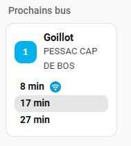
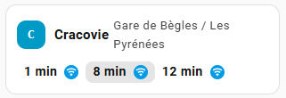

# TBM Horaires – Intégration Home Assistant + Carte Lovelace

Affiche les **prochains passages** (temps réel) des lignes TBM (tram / bus / bat³) pour un arrêt donné, via l’API **SIRI-Lite** de Bordeaux Métropole. Aucune page web n’est "scrapée" : on interroge directement l’API temps réel officielle.

## ✨ Fonctionnement

- Sélection de **ligne** + **destination** (ex. `Liane 1 - PESSAC CAP DE BOS, etc.`)
- Sélection de **l'arrêt** (ex. `Barrière de Pessac`).
- Validation de l'entité

## 🔧 Pré-requis

- Home Assistant (Core / OS / Supervised).
- Accès Internet vers l’API SIRI-Lite (domaine Bordeaux Métropole).

## 🚀 Intégration

### Installation automatique

[](https://my.home-assistant.io/redirect/hacs_repository/?owner=kpagnat&repository=tbm-horaires&category=integration)

### Installation manuelle

- Copier le dossier **`custom_components/tbm-horaires`** dans le répertoire `config/custom_components/` de votre instance.
- **Redémarrer Home Assistant**.
- Aller dans **Paramètres → Appareils & services → + Ajouter une intégration → TBM Horaires**.

### Création d'un 1er capteur (=une ligne+une direction+un arrêt)

Depuis l'intégration :

- **Sélectionner une ligne**
- **Choisir l'arrêt**
- **Valider l’entité**

> **Nom du capteur créé** : `TBM [Ligne] [Nom arrêt] [Destination]` (friendly_name).

## 🚌 Carte Lovelace (fichier JS)

1. Copier le dossier **`www/tbm-horaires-card`** dans `config/www/`.
2. Déclarer la ressource : **Paramètres → Tableaux de bord → Ressources → Ajouter**
   - **URL** : `/local/tbm-horaires-card/tbm-horaires-card.js`
   - **Type** : *JavaScript Module*
3. Ajouter la carte (Carte **Manuelle**) (avec éditeur) :

```yaml
type: custom:tbm-horaires-card
entity: sensor.tbm_1_goillot_pessac_cap_de_bos
count: 3
line_title: 1
line_bg: "#00B1EB"
realtime_icon: mdi:wifi
realtime_bg: var(--info-color)
realtime_color: '#ffffff'
```



```yaml
type: custom:tbm-horaires-card
entity: sensor.tbm_c_cracovie_gare_de_begles_les_pyrenees
horizontal: true
count: 3
line_title: C
grid_options:
  columns: 8
  rows: auto
```



---

### Logs de debug (configuration)

```yaml
logger:
  default: info
  logs:
    custom_components.tbm_horaires: debug
```

---

## 🔒 Respect des données

- Source : **API SIRI-Lite** de Bordeaux Métropole (clé publique).
- Aucune donnée personnelle n’est collectée.

---
